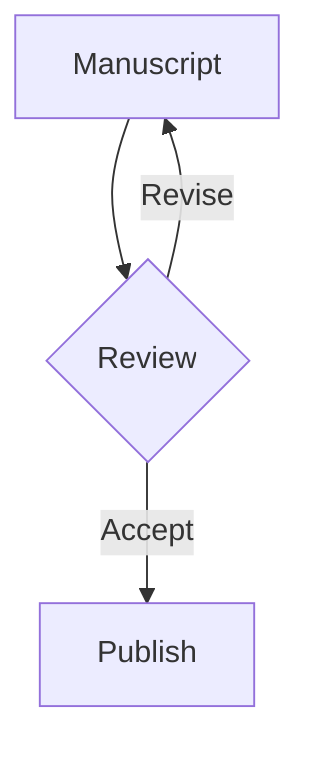

# Markdown Lab Ultra

## Editorial Intent

A publication-grade renderer turns a plain document into a composed spread. This lab demonstrates typographic rhythm, anchored paragraphs, and the narrative pace of motion. It also supports wiki links like [[markdown-showcase]] and missing references like [[Missing Draft|missing-slug]].

Here is a paragraph with a citation [@/doe2020] and another reference [@chen2022] woven into the prose.

### Callouts

:::note{title="Editorial Note"}
Keep the narrative crisp, let the warm paper breathe, and avoid unnecessary UI chrome.
:::

:::tip{title="Author Tip"}
Write headings as if they are the section names in a printed magazine. It improves scanability.
:::

:::warning{title="Warning"}
High-contrast palettes can break the warm paper aesthetic. Use tokens to keep consistency.
:::

:::danger{title="Critical"}
Do not ship raw HTML in Markdown. Use directives and components instead.
:::

:::theorem{title="Theorem"}
If a reader can keep rhythm across three screens, the editorial tone is set.
:::

### Task List

- [x] Draft a narrative outline
- [x] Design a two-column rhythm
- [ ] Review callout hierarchy

## Code Systems

### Highlighting and Titles

```ts title="lib/editorial/typography.ts" {2,5} showLineNumbers
export const tokens = {
  fontDisplay: "Noto Serif SC",
  fontUI: "Inter",
};

export const scale = {
  body: "1.02rem",
  lead: "1.2rem",
};
```

### Diff Language

```diff title="diff/spacing.patch" showLineNumbers
- padding: 12px;
+ padding: 18px;
+ gap: 20px;
```

### Code Tabs

:::tabs
:::tab{label="TypeScript"}
```ts title="colors.ts"
export const palette = {
  paper: "#f7f3ed",
  ink: "#151515",
};
```
:::

:::tab{label="CSS"}
```css title="prose.css"
.prose {
  line-height: 1.85;
  max-width: 72ch;
}
```
:::

:::tab{label="Shell"}
```bash title="deploy.sh"
pnpm run build
pnpm run start
```
:::
:::

## Math & Academic Layout

Inline math looks like $E = mc^2$ and block math keeps long equations readable:

$$
\int_{0}^{\infty} e^{-x^2} dx = \frac{\sqrt{\pi}}{2}
$$

A paragraph can carry multiple citations [@/smith2023] [@liu2024] and still remain legible.

## Diagrams & Charts

### Mermaid



### Chart Spec

```chart
{
  "type": "bar",
  "data": [
    { "month": "Jan", "views": 1200, "signups": 240 },
    { "month": "Feb", "views": 1600, "signups": 310 },
    { "month": "Mar", "views": 1400, "signups": 260 }
  ],
  "xKey": "month",
  "series": [
    { "key": "views", "label": "Views" },
    { "key": "signups", "label": "Signups" }
  ]
}
```

## Images & Gallery

A single image with caption:


:::gallery{columns="3"}


:::

## Tables & Data

| Layer | Purpose | Rhythm |
| --- | --- | --- |
| Header | Navigation | 72ch |
| Body | Reading | 1.85 |
| Aside | Context | 60ch |

### CSV Table

```csv
name,score,chapter
Warm Paper,92,Design
Catalog List,88,Layout
Motion Rail,95,Interaction
```

### JSON Table

```json-table
[
  { "system": "Typography", "status": "Ready", "owner": "Editorial" },
  { "system": "Motion", "status": "In Progress", "owner": "Design" },
  { "system": "Search", "status": "Ready", "owner": "Engineering" }
]
```

## Steps & Tutorials

:::steps{title="Editorial Workflow"}
:::step{title="Draft"}
Open the Markdown file and sketch the narrative arc.
:::
:::step{title="Compose"}
Use headings, callouts, and code blocks to organize the flow.
:::
:::step{title="Review"}
Check anchors, citations, and references before publishing.
:::
:::

## Embeds & Cards

::embed{url="https://example.com/editorial" title="External Reference" description="A sample external link card without crawling."}

::post{slug="markdown-showcase"}

## Footnotes & References

A paragraph with a footnote and a backlink.[^1]

[^1]: Footnotes are still part of the editorial rhythm. They should be styled gently.
