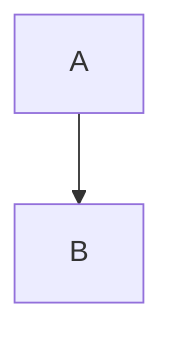

# Markdown Author Guide

This handbook describes every supported Markdown extension in the Ultra renderer. All extensions are optional and can be toggled via feature flags.

## Headings & Anchors

Use H2-H4 for structure. Anchors are injected automatically.

```md
## Section Title
### Subsection
#### Detail
```

## Callouts

```md
:::note{title="Editorial Note"}
Body text
:::

:::tip{title="Author Tip"}
Body text
:::

:::warning{title="Warning"}
Body text
:::

:::danger{title="Critical"}
Body text
:::
```

## Code Blocks

````md
```ts title="src/example.ts" {2} showLineNumbers
const a = 1;
const b = 2;
```
````

Diff blocks:

````md
```diff
- removed
+ added
```
````

Code tabs:

````md
:::tabs
:::tab{label="TypeScript"}
```ts
console.log("hello");
```
:::

:::tab{label="CSS"}
```css
body { color: black; }
```
:::
:::
````

## Math

```md
Inline math $E=mc^2$ and block math:

$$
\int_{0}^{\infty} e^{-x^2} dx = \frac{\sqrt{\pi}}{2}
$$
```

## Mermaid Diagrams

````md

````

## Charts

````md
```chart
{
  "type": "line",
  "data": [{ "month": "Jan", "value": 10 }],
  "xKey": "month",
  "series": [{ "key": "value", "label": "Value" }]
}
```
````

## Citations

```md
Use citations like [@/doe2020].
```

References are loaded from `content/_demos/refs.json` or another JSON file and rendered at the bottom of the page.

Per-article references (recommended):

```md
---
title: "Post Title"
date: "2025-12-24"
slug: "post-title"
category: "system"
tags: ["markdown"]
references: "refs/post-title.json"
---
```

Store the JSON at `content/refs/post-title.json` (same schema as the demo refs).

## Wiki Links

```md
[[markdown-showcase]]
[[Title|slug]]
```

Missing links show with a dashed underline.

## Embeds

```md
::embed{url="https://example.com" title="External" description="Optional description"}
::post{slug="markdown-showcase"}
```

## Tables

```md
| Column | Value |
| --- | --- |
| A | 1 |
```

CSV or JSON tables:

````md
```csv
name,score
Warm,90
```

```json-table
[{ "name": "Warm", "score": 90 }]
```
````

## Gallery

```md
:::gallery{columns="3"}


:::
```

## Steps

```md
:::steps{title="Workflow"}
:::step{title="Draft"}
Write the draft.
:::
:::step{title="Review"}
Review and publish.
:::
:::
```

## Footnotes

```md
Footnote example.[^1]

[^1]: Footnote text.
```
